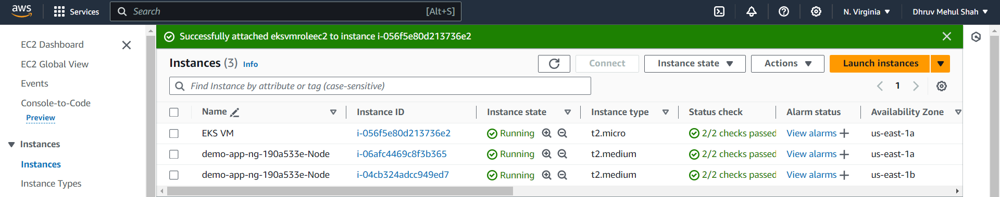

# Set Up the EKS Cluster

## Prerequisites

Before diving in, make sure you have the following:

- An active AWS account.
- Basic understanding of AWS, Kubernetes, and EKS concepts
- Permissions to create resources within your AWS account

## Setting up the EKS Management Host

### Step 1. Launch an Ubuntu VM on AWS:

- Create a new EC2 instance using the t2.micro instance type. Choose Ubuntu as the operating system.


### Step 2. Connect to the instance:

Use SSH or your preferred method to establish a connection to the newly launched machine.


#### Setting up Necessary tools to proceed with the EKS Cluster Setup

1. Install kubectl:

```sh
# Instructions for installing kubectl on Ubuntu
$ curl -o kubectl https://amazon-eks.s3.us-west-2.amazonaws.com/1.19.6/2021-01-05/binlinux/amd64/kubectl
$ chmod +x ./kubectl
$ sudo mv ./kubectl /usr/local/bin
$ kubectl version --short --client
```


2. Install AWS CLI:

```sh
# Instructions for installing the latest AWS CLI version
$ sudo apt install unzip
$ cd
$ curl "https://awscli.amazonaws.com/awscli-exe-linux-x86_64.zip" -o "awscliv2.zip"
$ unzip awscliv2.zip
$ sudo ./aws/install
$ aws --version
```


3. Install eksctl:

```sh
# Instructions for installing eksctl
$ curl --silent --location "https://github.com/weaveworks/eksctl/releases/latest/download/eksctl_$(uname -s)_amd64.tar.gz" | tar xz -C /tmp
$ sudo mv /tmp/eksctl /usr/local/bin
$ eksctl version
```


### Step 3. Create IAM role & attach to EKS Management Host:

1. Create a new IAM role:

- Navigate to the IAM service in the AWS console.
- Choose "Use case - ec2" and proceed.
- Attach the following permissions to the role: IAM - fullaccess, VPC - fullaccess, EC2 - fullaccess, CloudFomration - fullaccess, Administrator - access.
- Name the role "eksroleec2" (or your preferred name).


2. Attach the role to the EKS Management Host:

- Go to the EC2 console and select your EKS Management Host instance.
- Click on "Security" and then "Modify IAM Role".
- Attach the "eksroleec2" role you created.


### Step 4. Create EKS cluster

1. Use eksctl to create the cluster:

```sh
# Replace the placeholders with your desired values.
$ eksctl create cluster \
  --name <cluster-name> \
  --region <region-name> \
  --node-type <instance-type> \
  --nodes-min 2 \
  --nodes-max 2 \
  --zones <availability-zones>
```


2. Wait for cluster setup:
- The cluster setup typically takes around 5-10 minutes.



3. Verify node status:
- Once the setup is complete, check the node status using:
```sh
$ kubectl get nodes
```
- Upon successful completion of the setup, you'll see a console output similar to the following:


### Control Plane Management

EKS handles the control plane for you, so you don't need to worry about its direct management. This means you can focus on your applications and workloads while EKS takes care of the underlying infrastructure.


