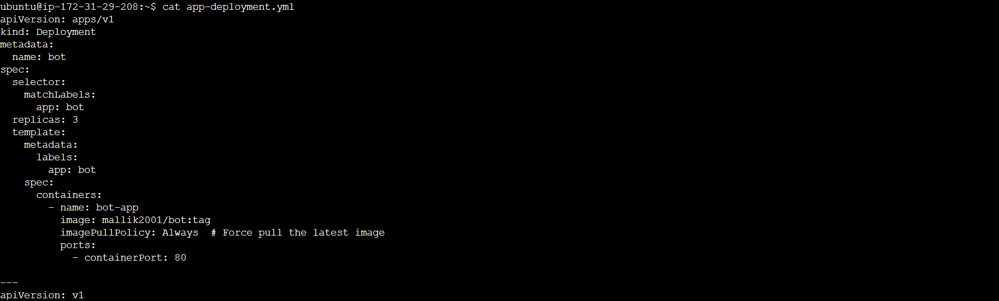
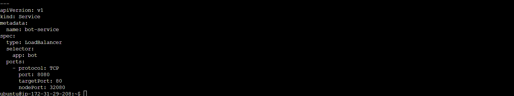
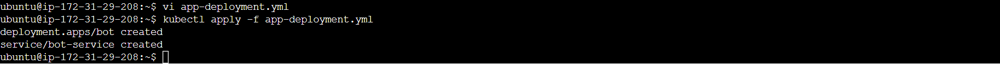
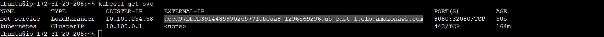
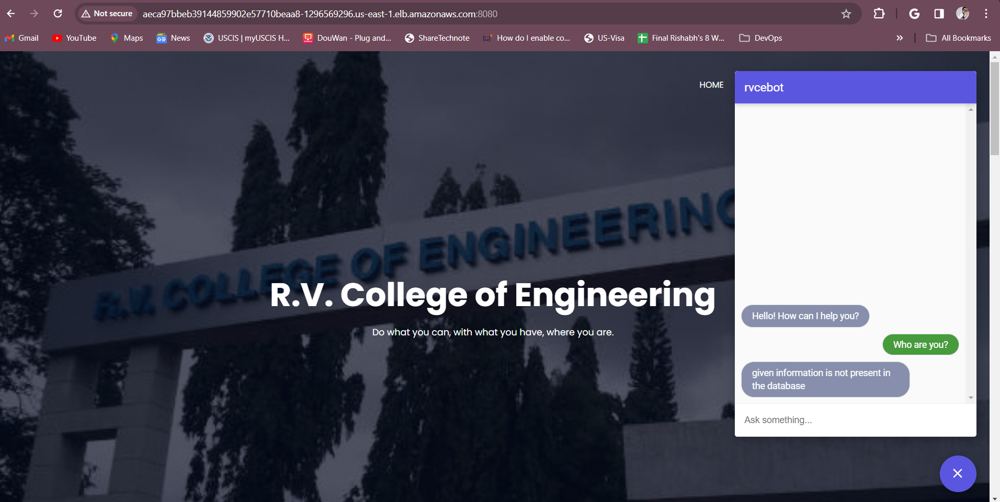

# Build and package the chatbot application as a Docker image

### Deploying the Sample Bot Application

- While I haven't personally developed this bot application, I've successfully deployed it using a YAML file to showcase its capabilities within the EKS cluster. The application's key technologies include:
- Frontend: HTML, CSS, and JavaScript
- Natural Language Understanding: Google Dialogflow

### Monitoring and Insights

- To effectively monitor resource usage and performance, I've integrated Prometheus and Grafana into the cluster:

- Prometheus: Collects and stores metrics from the cluster and application.
- Grafana: Visualizes the collected metrics in informative dashboards.
- This setup enables us to gather valuable insights into the cluster's health and the application's performance, aiding in optimization and troubleshooting efforts.

Here's the deployment file that defines how the application will be deployed in the EKS cluster:
```yaml
# Deployment Configuration
apiVersion: apps/v1
kind: Deployment
metadata:
  name: bot
spec:
  selector:
    matchLabels:
      app: bot
  replicas: 3  # Run 3 replicas of the application
  template:
    metadata:
      labels:
        app: bot
    spec:
      containers:
        - name: bot-app
          image: mallik2001/bot:tag  # Replace with the actual image name and tag
          imagePullPolicy: Always  # Ensure the latest image is used
          ports:
            - containerPort: 80  # Port exposed by the container

# Service Configuration
apiVersion: v1
kind: Service
metadata:
  name: bot-service
spec:
  type: LoadBalancer  # Exposes the service externally
  selector:
    app: bot  # Targets the bot pods
  ports:
    - protocol: TCP
      port: 8080  # External port
      targetPort: 80  # Port on the pods
      nodePort: 32080  # Port on the cluster nodes
```
### Key Points:

- Deployment: Specifies the desired state of the application, including the number of replicas and container specifications.
- Service: Exposes the application to external traffic, enabling access from outside the cluster.
- LoadBalancer Type: Automatically creates a load balancer to distribute traffic across the application pods.
- Ports: Define the ports for external access (port 8080) and internal communication within the cluster (port 80).
- ImagePullPolicy: Ensures that the latest container image is always used for deployments.

To deploy this application, create a YAML file with above configurations and apply it using kubectl:

```sh
# Create the deployment file
$ vi app-deployment.yaml

# Display the created deployment file
$ cat app-deployment.yaml

# Deploy the application
$ kubectl apply -f app-deployment.yaml
```







### Verifying Deployment and Services

To check the status of the deployed application and services, use the following kubectl commands:

- View deployed pods:
```sh
$ kubectl get pods
```
- View deployed services:
```sh
$ kubectl get svc
```


### Accessing the Application

The application is now ready for interaction! Access it using this URL in the web browser:
```
http://<<External load Balancer>>:8080/
```


