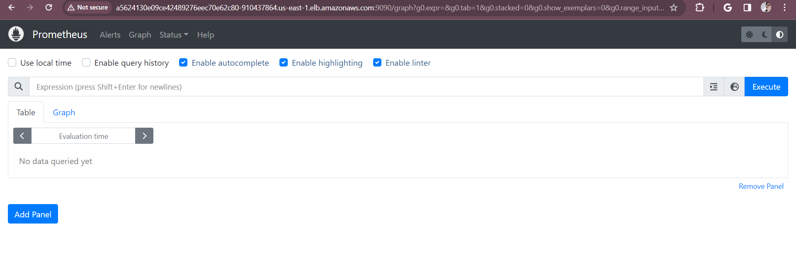

# Deploy the Prometheus and Grafana operator and scrape metrics from the EKS cluster and chatbot pods

### Streamlined Monitoring with Helm Charts

To establish a robust monitoring setup, we'll leverage Helm, a package manager for Kubernetes, to effortlessly deploy Prometheus and Grafana. Helm charts encapsulate pre-configured packages, streamlining the installation process and minimizing potential errors.

### Prerequisites

- Helm: Ensure Helm is installed in your Kubernetes cluster.
- Metrics Server: Verify that the metrics server is running in your cluster to collect resource usage metrics.

### Installation Steps

#### Enabling Metrics Server and Deploying Monitoring Tools

Here's a comprehensive guide to setting up the metrics server and deploying Prometheus and Grafana within your Kubernetes cluster:

#### 1. Add Helm Repositories:

- Add the latest Helm repository:
```sh
$ curl -fsSl -o get_helm.sh https://raw.githubusercontent.com/helm/helm/master/scripts/get-helm-3
$ chmod 700 get_helm.sh
$ ./get_helm.sh
$ helm version
```


#### 2. Verify Metrics Server:
- Check pod metrics:
```sh
$ kubectl top pods
```
- Check node metrics:
```sh
$ kubectl top nodes
```
- List Helm repositories:
```sh
$ helm repo ls
```


- If the metrics-server repository is absent, add it:
```sh
$ helm repo add metrics-server https://kubernetes-sigs.github.io/metrics-server/
```
- Update the repository cache:
```sh
$ helm repo update
```


#### 3. Install Metrics Server (if needed):
```sh
$ helm upgrade --install metrics-server metrics-server/metrics-server
```


- Once, Metrics Server is installed, can check the metrics using the previous commands.


#### 4. Deploy Prometheus and Grafana:
- Add Helm repositories:
```sh
$ helm repo add stable https://charts.helm.sh/stable
$ helm repo add prometheus-community https://prometheus-community.github.io/helm-charts
$ helm repo update
```


- Install Prometheus:
```sh
$ helm install stable prometheus-community/kube-prometheus-stack
```

- Verify pods and services:
```sh
$ kubectl get pods
$ kubectl get svc
```


- Expose services:
```sh
$ kubectl edit svc stable-kube-prometheus-sta-prometheus  # Change service type to LoadBalancer
$ kubectl edit svc stable-grafana  # Change service type to LoadBalancer
``` 


- Verify service updates:
```sh
$ kubectl get svc
```


- Access Prometheus and Grafana:

Use the LoadBalancer URLs provided in the kubectl get svc output to access their respective web interfaces.

The Prometheus UI is available at `http://<prometheus_endpoint>:9090`.

The Grafana UI is available at `http://<grafana_endpoint>:3000`.




### Accessing the Grafana Dashboard

Here are the steps to access your Grafana dashboard:

- Open Your Web Browser: Launch your preferred web browser.
- Navigate to the Grafana URL: Enter the LoadBalancer URL for Grafana, which you can obtain using the command kubectl get svc.
- Enter Credentials: When prompted, provide the following credentials:
```
Username: admin
Password: prom-operator
```
- Explore the Dashboard: Upon successful login, you'll be presented with Grafana's user-friendly interface.

With these tools in place, you'll gain valuable insights into your cluster's health and performance, enabling informed decision-making and optimization.

