# Configure a datasource for Prometheus and Grafana

## Uncovering Insights with Prometheus

Prometheus, your cluster's vigilant observer, is now ready to share its knowledge. Follow these steps to access its insights:

##### 1. Access the Prometheus UI:
- Retrieve the Prometheus UI URL, typically a load balancer URL provided during setup.
Launch your web browser and enter the URL.

##### 2. Navigate to the Status Section:
- Once logged in, explore the Status section, where Prometheus reveals its valuable observations.

##### 3. Review Cluster Health and Availability:
- Within the Status section, you'll find overviews of various monitored metrics and targets, offering insights into your cluster's health and availability.

##### 4. Explore Targets:
- Pay close attention to the Targets section, which showcases the specific components and services Prometheus is monitoring, such as nodes, containers, and applications.
- Each target's current status is displayed, providing a real-time overview of your cluster's components.

Prometheus acts as your eyes within the cluster, enabling you to visualize and analyze its metrics for informed decision-making and optimization. Regularly utilizing Prometheus's insights empowers you to maintain a healthy, responsive, and optimized Kubernetes cluster, ensuring optimal performance and overall system reliability.

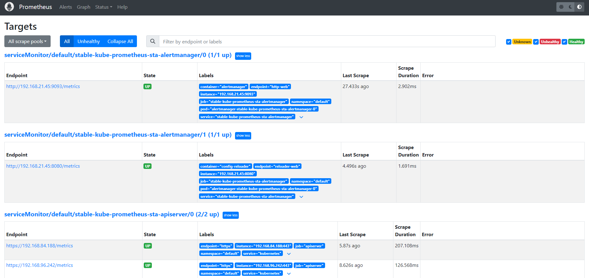

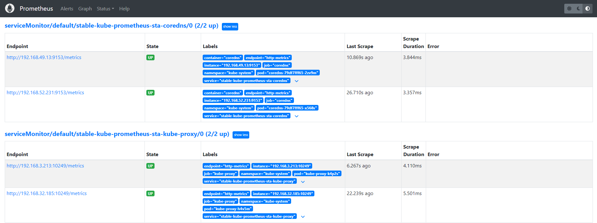

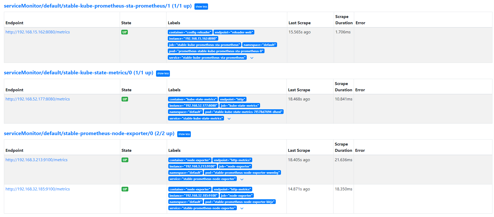

## Unleashing the Power of Visualization with Grafana

Grafana, your visual storyteller, awaits to bring your metrics to life. Here's how to unlock its potential:

### Access the Grafana Canvas:

- Open your web browser and navigate to the Grafana URL.
- Use the default credentials for login: Username: admin and Password: prom-operator

### Connect to Prometheus:

- Click the Configuration icon (gear icon) in the left sidebar.
- Select Data Sources and click Add data source.
- Choose Prometheus as the type and provide the necessary details, including the Prometheus URL.

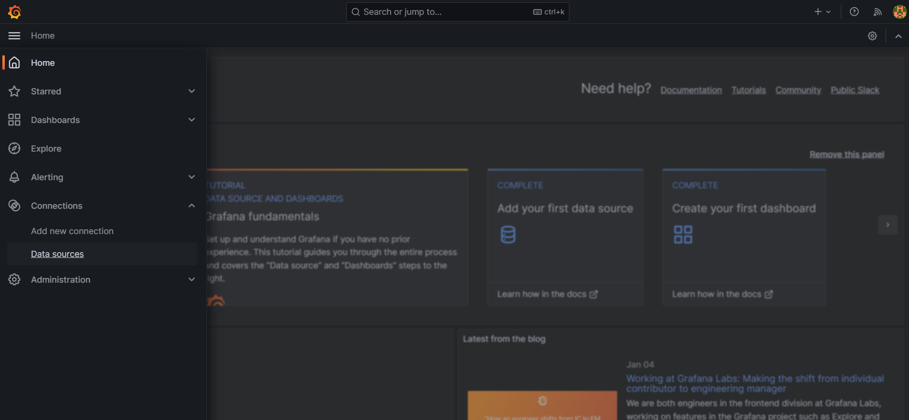

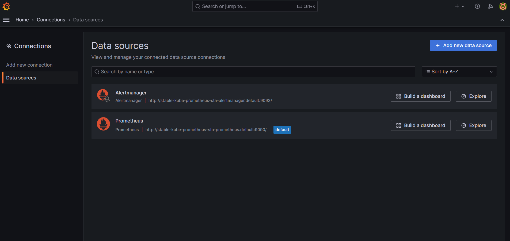

- Create Custom Dashboards:

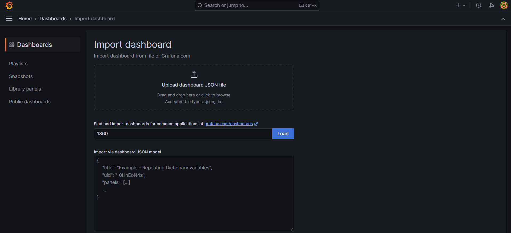

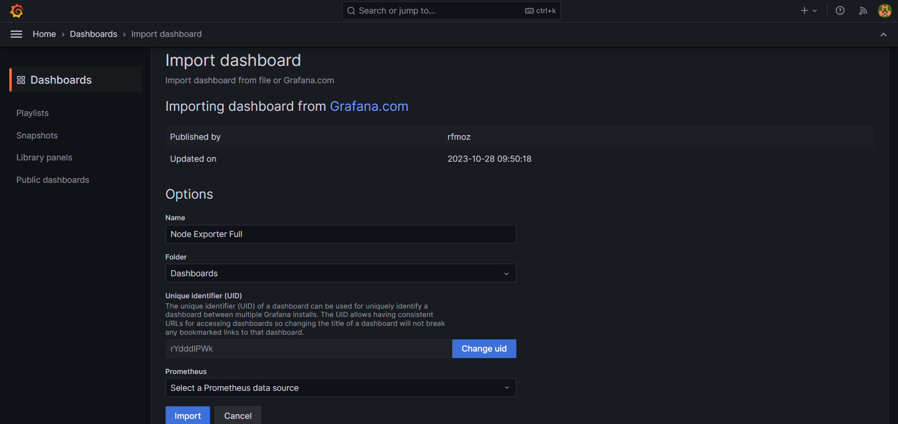

Once connected, unleash your creativity by crafting custom dashboards that visually narrate your cluster's story.

Grafana offers an intuitive interface to create graphs, charts, and other compelling visualizations, enabling you to explore and analyze your metrics in-depth.

### Importing Pre-Built Dashboards: A Shortcut to Insights

- Grafana offers a wealth of pre-built dashboards, meticulously crafted by the community and Grafana Labs. Here's how to incorporate their wisdom into the workspace:

- Navigate to the Dashboard Creation Page:

    - Within the Grafana UI, click Dashboards in the left sidebar.
    - Click the New button to initiate dashboard creation.
    - Access Import Options:
    - In the dashboard editor, locate the Import button and click it.

- Locate a Pre-Built Dashboard:

    - Embark on a treasure hunt for suitable dashboards within the vast realms of Grafana Labs' website or community repositories.
    - Once you've discovered a dashboard that aligns with your monitoring goals, copy its JSON or YAML code.

- Import the Dashboard:

    - Return to the Grafana UI's import field and paste the copied code.
    - Click the Load button to initiate the dashboard's integration.

- Customize and Save:

    - Review the imported dashboard, examining its layout and visualizations.
    - Tailor it to your specific needs by adjusting configurations or visualizations as desired.
    - Click Save to make the dashboard a permanent resident within your Grafana workspace.

- By leveraging pre-built dashboards, you can quickly gain valuable insights into your cluster's health and performance without having to start from scratch.

[Grafana Pre-built Dashboards](https://grafana.com/grafana/dashboards/)

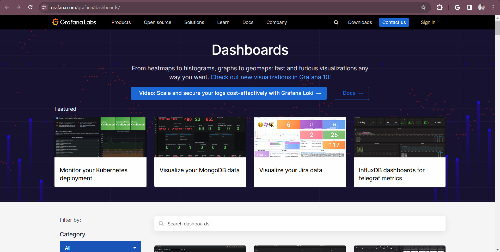

### Navigating the Dashboard Universe

- Grafana's Dashboards section is your gateway to visualization mastery:

- Access Dashboards: Click Dashboards in the left sidebar menu.
- Discover Dashboards: Explore existing dashboards using the search bar.
- Create New Dashboards: Click the New button to craft a blank canvas or select a template to kickstart your visualization journey.
- Organize with Playlists: Group related dashboards into playlists for focused analysis.
Capture Moments with Snapshots: Preserve specific dashboard states for future reference or comparison.
- Explore the Library: Discover a treasure trove of pre-built panels to extend your visual storytelling capabilities.
- Grafana empowers you to transform raw metrics into captivating visual narratives, providing profound insights into your Kubernetes cluster's performance and health.

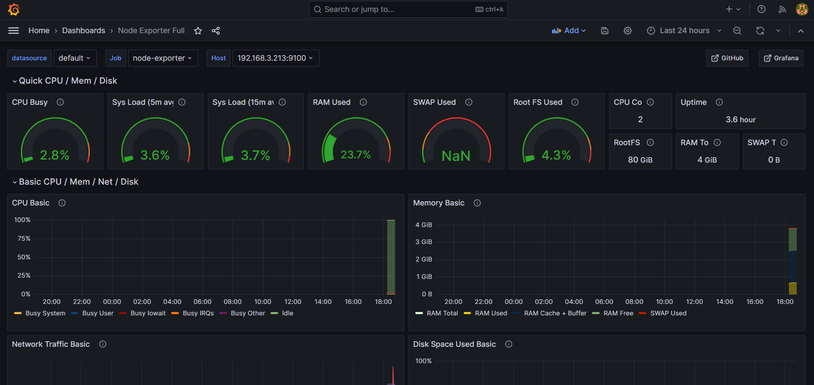

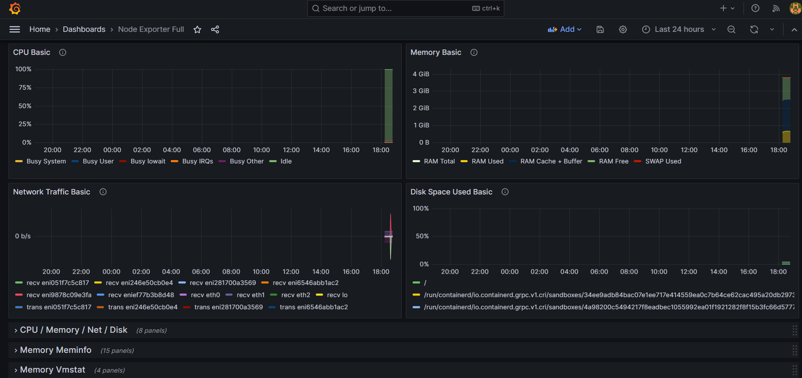

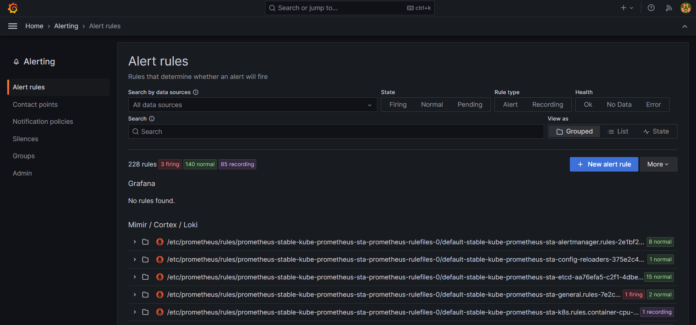

