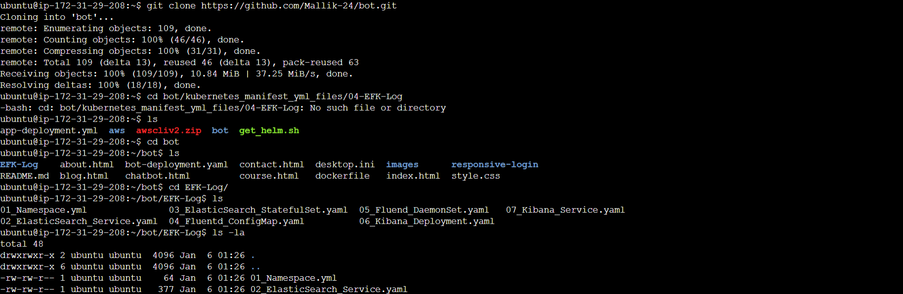
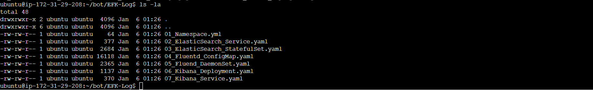
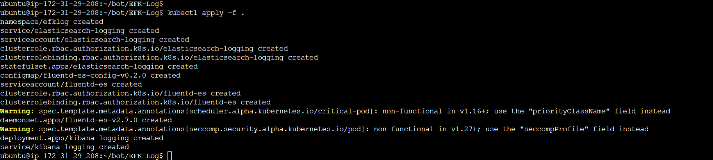
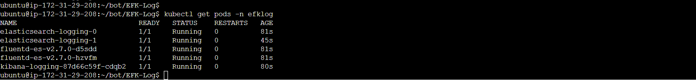
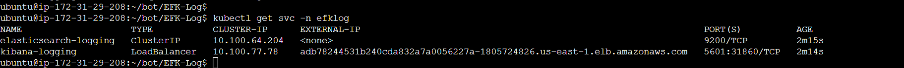
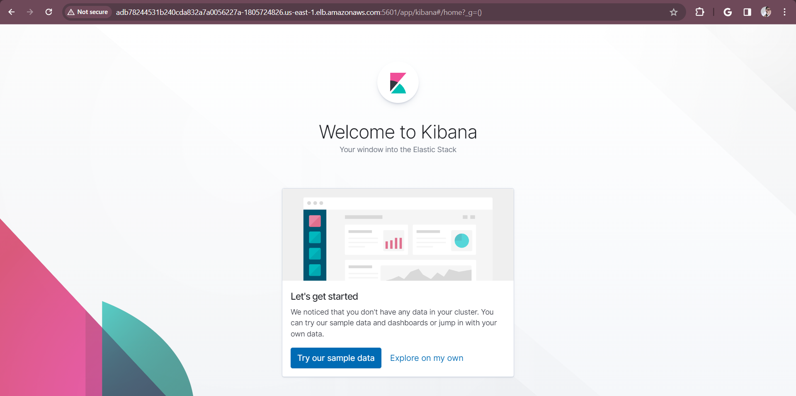
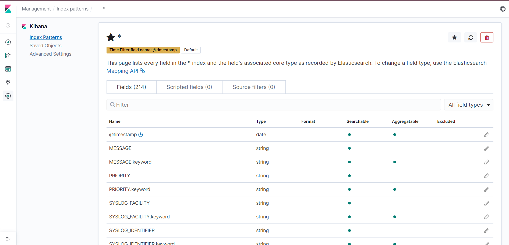
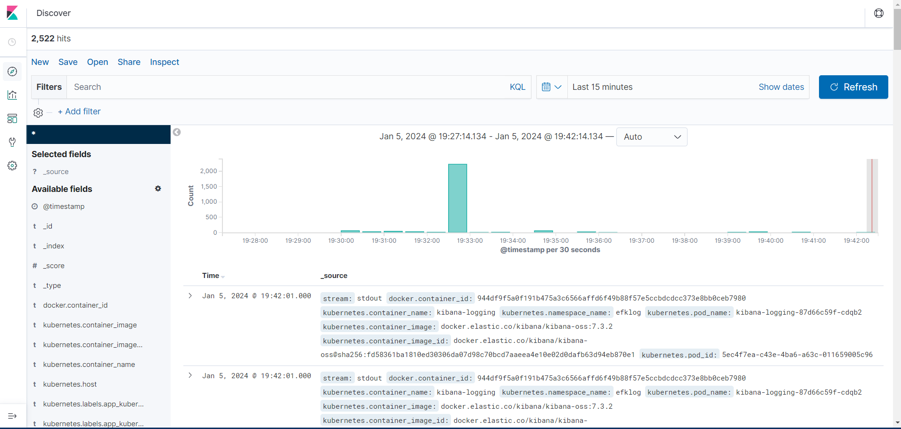

# Deploy the ELK stack using the official Helm chart or Docker images

## Taming Your Logs with the EFK Stack

Unleash the power of centralized logging and visualization with the EFK stack, a dynamic trio comprising:

- **Elasticsearch:** A scalable, distributed search engine designed to store and retrieve massive amounts of log data.
- **Fluent Bit:** A lightweight and efficient log collector and forwarder, expertly gathering logs from diverse sources and seamlessly channeling them to their intended destinations.
- **Kibana:** A user-friendly graphical interface that empowers you to visualize, query, and interact with your logs, transforming them into actionable insights.

### Deployment Steps for Log Mastery

- Clone Repository: Acquire the EFK manifest files by cloning the designated GitHub repository.
```sh
$ git clone https://github.com/Mallik-24/bot.git
```
- Navigate to EFK Directory: Access the directory containing the deployment blueprints.
```sh
$ cd bot/kubernetes_manifest_yml_files/04-EFK-Log
$ ls -la
```





- Create EFK Deployment: Apply the manifest files to orchestrate the EFK stack's deployment.
```sh
$ kubectl apply -f .
```


- Verify Pod Status: Confirm the health and readiness of the pods within the efklog namespace.
```sh
$ kubectl get pods -n efklog
```


- Get Service Information: Retrieve details about the services operating within the efklog namespace.
```sh
$ kubectl get svc -n efklog
```


- Enable Kibana Security: Ensure port 5601 is accessible for secure Kibana interaction.
- Access Kibana URL: Launch your web browser and navigate to the Kibana dashboard.
    - The Kibana UI is available at `http://<kibana_endpoint>:5601`.
- Create Index Patterns: Construct index patterns to organize and efficiently query log data.
- Explore Logs in Kibana: Unleash your curiosity and delve into your logs through Kibana's intuitive interface.







## Visualizing Insights and Pinpointing Issues

- Visualize Container Activity: Observe log entries, HTTP requests, status codes, methods, and user agents to gain a comprehensive understanding of container behavior.
- Identify Errors and Their Origins: Pinpoint precise timestamps for errors, along with error descriptions, originating IP addresses, and target hosts to quickly diagnose and resolve issues.
- Inspect Raw Log Data: Examine JSON documents containing raw log entries for in-depth analysis and troubleshooting.
- By embracing the EFK stack, you'll harness the power of centralized logging, enabling effective troubleshooting, performance optimization, and enhanced security within your Kubernetes cluster.


